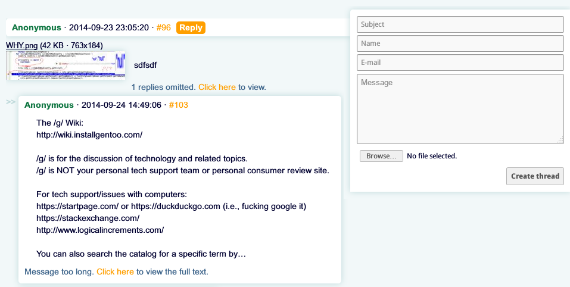

# AyaIB

AyaIB was an imageboard web application in alpha stage, written in Scala. The project was active in 2014.

## Technologies used

- **Scala**
- **Play Framework**
- **MongoDB** (with **ReactiveMongo**)
- **sbt**, **Typesafe Activator**
- **HTML**, **LESS**

## Screenshots

- [Board view](screenshots/board-view.png?raw=true)
- [Staff panel](screenshots/staff-panel.png?raw=true)

## What was not done

- Board management
- Staff activities regarding posts and threads
- Staff management
- Inter-board quotelinks in posts
- Bans
- Theming, Youtsuba B theme port
- JSON API
- Client-side usability-related JQuery scripts
- i18n
- WebM support
- …

## Licensing

See the [COPYING](https://github.com/fauu/AyaIB/blob/master/COPYING) file.
